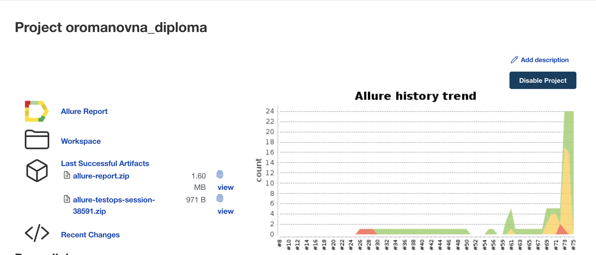
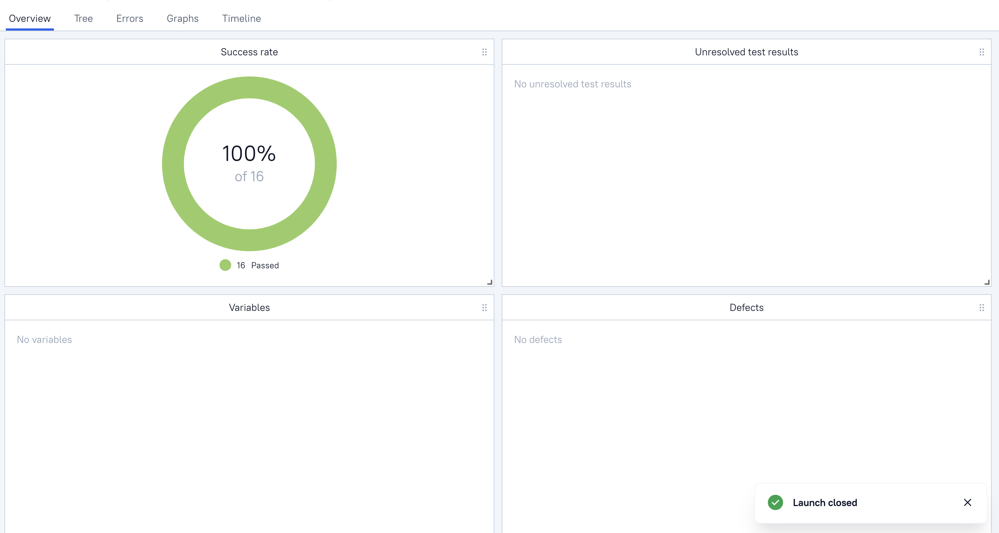
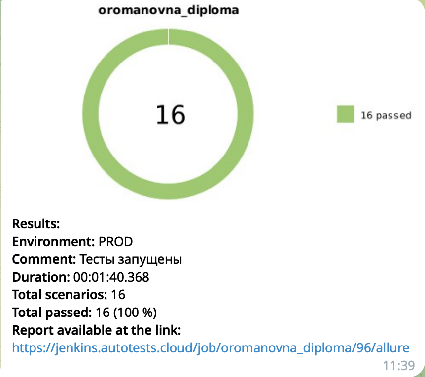

# QA Guru: Дипломный проект
Реализация набора автотестов (UI, API) для сервиса <code>thinking-tester-contact-list.herokuapp</code>

Проект реализован с использованием:

          

Запуск тестов и формирование отчетов о запусках формируется с помощью:
 - <code>Jenkins;</code>
 - <code>Selenoid;</code>
 - <code>Allure TestOps.</code>

# Покрытый функционал

## <a href='https://github.com/OlgaRomanovna/qa_guru_diploma/tree/main/web'>UI-тесты</a>
 - авторизация пользователя;
 - добавление контакта в список контактов пользователя;
 - выход из учетной записи.

## <a href='https://github.com/OlgaRomanovna/qa_guru_diploma/tree/main/api'>API-тесты</a>
 - получение профиля пользователя;
 - регистрация пользователя;
 - удаление пользователя;
 - авторизация пользователя;
 - выход из учётной записи;
 - добавление контакта в список контактов пользователя;
 - получение информации о контакте;
 - частичное обновление информации о контакте;
 - полное обновление информации о контакте;
 - удаление контакта пользователя.

## Подготовка перед запуском
- создать файл с данными уже существующего пользователя;
- создать файл с данными об удалённом сервере selenoid;
- создать файл с данным об телеграм-боте, куда необходимо отправить данные о прохождении тестов.

## Полезные ссылки
 - [Тестируемое web-приложение](https://thinking-tester-contact-list.herokuapp.com/);
 - [Job Jenkins](https://jenkins.autotests.cloud/job/oromanovna_diploma/);
 - [Allure report](https://jenkins.autotests.cloud/job/oromanovna_diploma/allure/).

## Запуск автотестов

```
python -m venv .venv
source .venv/bin/activate
pip install -r requirements.txt
pytest .
```

## Интеграция с Jenkins
- для запуска тестов на сервере настроена job'a в Jenkins.


## Интеграция с Allure
- после прохождения тестов будет собран отчёт на основе генератора Allure;

- к api тестам приложены logs, cUrl;

- к UI тестам приложены video, html, logs, screenshot;


## Интеграция с Allure TestOps
- результаты прохождения тестов, а также сами тест-кейсы будут отправлены в TestOps Allure;

- на основе результатов будет сгенерирован дашборд


## Интеграция с Jira
- в задачу регресса добавлены пройденные тест-кейсы
- а также запущенный лаунч


## Нотификация в Telegram
- после прохождения тестов результаты будут отправлены в Telegram;  


## Пример прохождения UI-теста

